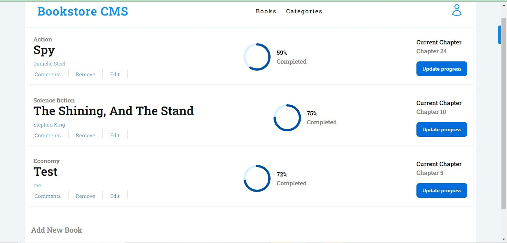

   
  <h3><b>BookStore</b></h3>

# 📗 Table of Contents

- [📗 Table of Contents](#-table-of-contents)
- [📖 \[Book Store\] ](#-book-store-)
  - [🛠 Built With ](#-built-with-)
    - [Tech Stack ](#tech-stack-)
    - [Key Features ](#key-features-)
  - [🚀 Live Demo ](#-live-demo-)
  - [💻 Getting Started ](#-getting-started-)
    - [Prerequisites](#prerequisites)
    - [Setup](#setup)
    - [Install](#install)
    - [Usage](#usage)
    - [Run tests](#run-tests)
    - [Deployment](#deployment)
  - [👥 Authors ](#-authors-)
  - [🔭 Future Features ](#-future-features-)
  - [🤝 Contributing ](#-contributing-)
  - [⭐️ Show your support ](#️-show-your-support-)
  - [🙏 Acknowledgments ](#-acknowledgments-)
  - [📝 License ](#-license-)

# 📖 [Book Store] 

**Books Store** is a simple website that displays a list of books and allows you to add and remove books from that list.

  

## 🛠 Built With 

### Tech Stack 

  
Client

  <ul>
    <li><a href="#">CSS</a></li>
    <li><a href="#">JSX</a></li>
    <li><a href="#">React</a></li>
    <li><a href="#">Redux</a></li>
  </ul>

<!-- Features -->

### Key Features 

- **Display Books**
- **Add books with author and title**
- **Remove them**
- **save the data in local storage**

(<a href="#readme-top">back to top</a>)

<!-- LIVE DEMO -->

## 🚀 Live Demo 

- [Live Demo Link](https://bookstore-cms-jalloh.netlify.app/)

(<a href="#readme-top">back to top</a>)

<!-- GETTING STARTED -->

## 💻 Getting Started 

- Open your Terminal
- Navigate to the desired directory to which you want to clone the repository to
- [Copy & Paste] git clone https://github.com/aradradev/bookstore.git

### Prerequisites

In order to run this project you need:

- Basic knowledge of react, redux and CSS
- Basic understanding of Linters
- Basic understanding of Github
- Your machine should have Chrome and VSCode installed

### Setup

Clone this repository to your desired folder:

- git clone https://github.com/aradradev/bookstore.git

### Install

Install this project with:

- You need to install Chrome if you want to see it working locally

### Usage

To run the project, execute the following command:

- open index.html with Chrome or other browsers.

### Run tests

To run tests, run the following command:

- npm install
- npm start
- npx stylelint "\*_/_.{css,scss}"
- npx hint .
- npx eslint . --fix

### Deployment

You can deploy any service you want.

(<a href="#readme-top">back to top</a>)

<!-- AUTHORS -->

## 👥 Authors 

👤 **Jalloh**

- GitHub: [aradradev](https://github.com/aradradev)
- Twitter: [@abdoul_2023](https://twitter.com/Abdoul_2023)
- LinkedIn: [Abdourahmane Diallo](https://www.linkedin.com/in/abdoul-ramane-diallo-15b2a2262/)

(<a href="#readme-top">back to top</a>)

<!-- FUTURE FEATURES -->

## 🔭 Future Features 

- [ ] **Styling**
- [ ] **Animation**

(<a href="#readme-top">back to top</a>)

<!-- CONTRIBUTING -->

## 🤝 Contributing 

Contributions, issues, and feature requests are welcome!

Feel free to check the [issues page](https://github.com/aradradev/add-awesome-Book/issues).

(<a href="#readme-top">back to top</a>)

<!-- SUPPORT -->

## ⭐️ Show your support 

If you like this project give it a ⭐️

(<a href="#readme-top">back to top</a>)

<!-- ACKNOWLEDGEMENTS -->

## 🙏 Acknowledgments 

I would like to say thank all co-authors and contributors

(<a href="#readme-top">back to top</a>)

<!-- LICENSE -->

## 📝 License 

This project is [MIT](./MIT.md) licensed.

(<a href="#readme-top">back to top</a>)

